He creado un script para MT4 que permite asignar en montos de dinero, el SL por defecto que se asigna automáticamente a las operaciones manuales que creamos, esto no sustituye al humano detrás de las operaciones, solo facilita que cuando creemos una operación manual, siempre se asigna un SL por defecto, en este caso es de 30 dólares con respecto al precio de la orden. Si asignas un SL mayor a los 30 dólares con respecto al precio inicial, automáticamente asignara los 30 pero después lo podrás cambiar a tu gusto.

Esta creado para evitar que se creen ordenes con SL que permitan perdidas elevadas o totales de nuestro dinero, por un descuido al crear la orden. Recuerda que el uso es Solo tu responsabilidad. 

NOTA: LEELO, NUNCA CONFIES EN UN CODIGO QUE OTRO ESCRIBIO, USA IA COMO CHATGPT O GEMINI, PARA VALIDAR SI EL CONTENIDO ES SEGURO DE UTILIZAR. Comparto este código bajo tu propio riesgo de uso, no está pensado para sustituir tu atención en las operaciones. Eres el único responsable al utilizarlos, sin perjuicio para terceras personas.

El monto por defecto puede ser cambiado en el script o desde los menús de configuración como se indica en la guía. 

La opciones para descargarlo  directamente los encuentras en  , es una ayuda.  Es gratis. Y espero que sea de ayuda para quien lo usa. 

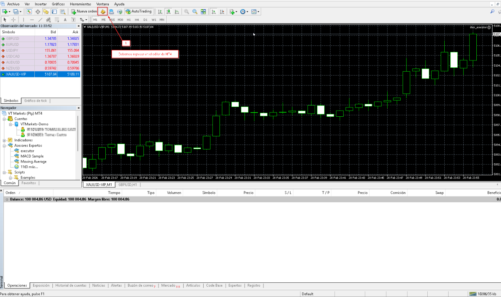

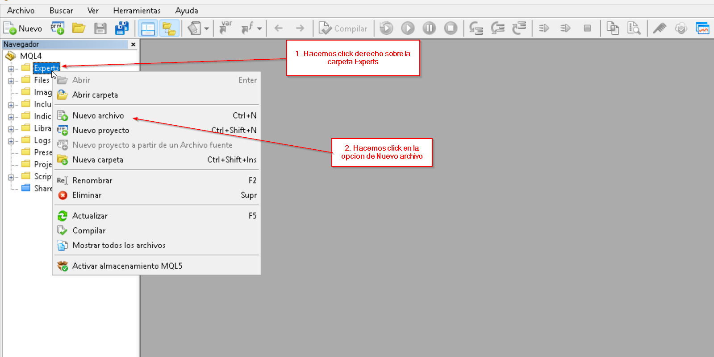

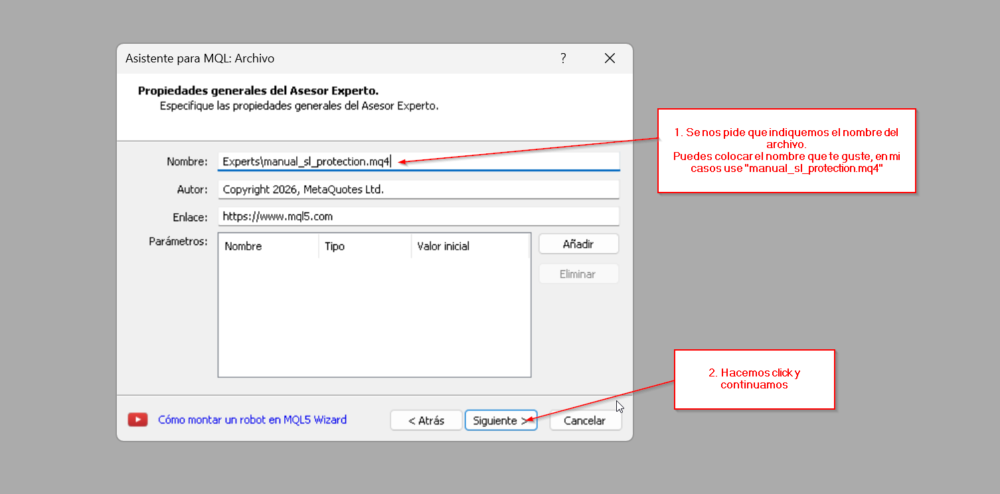

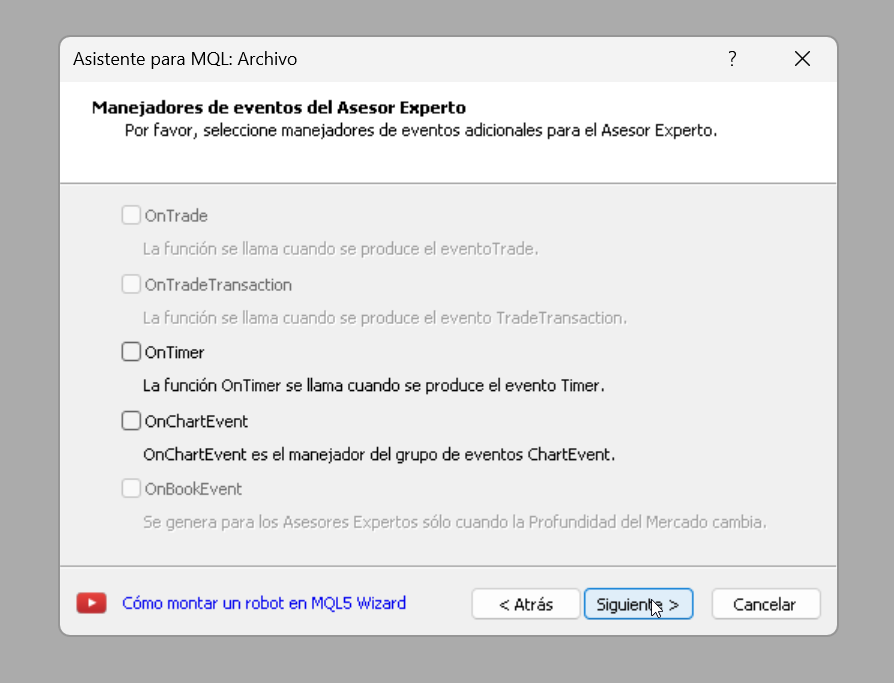

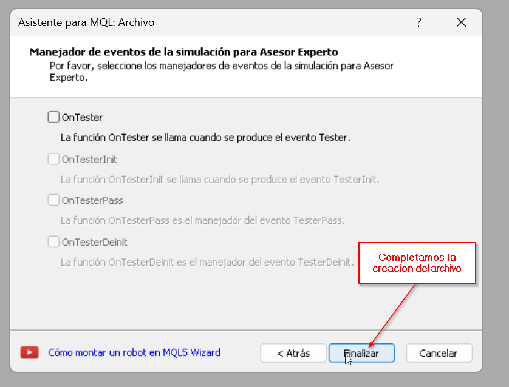

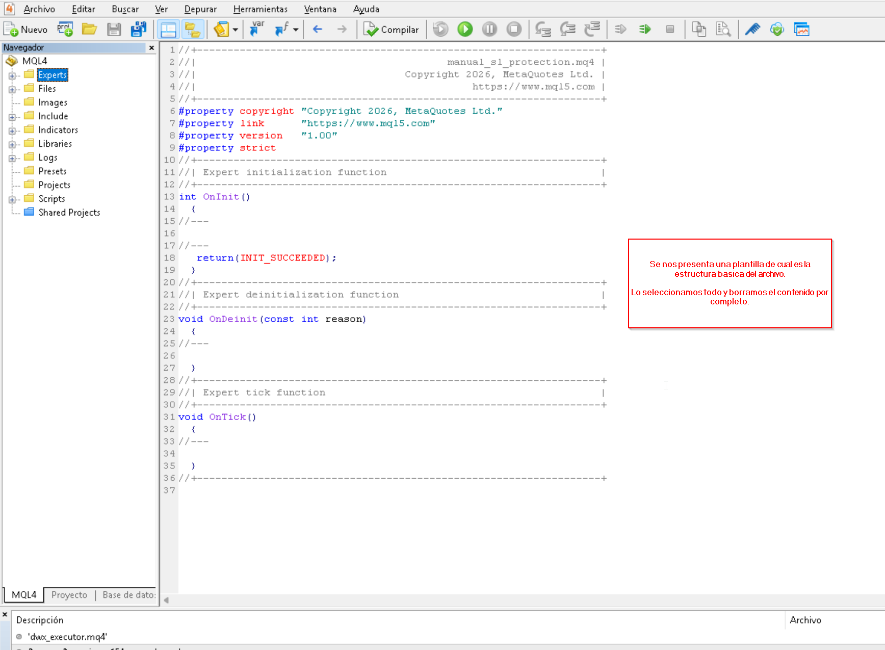

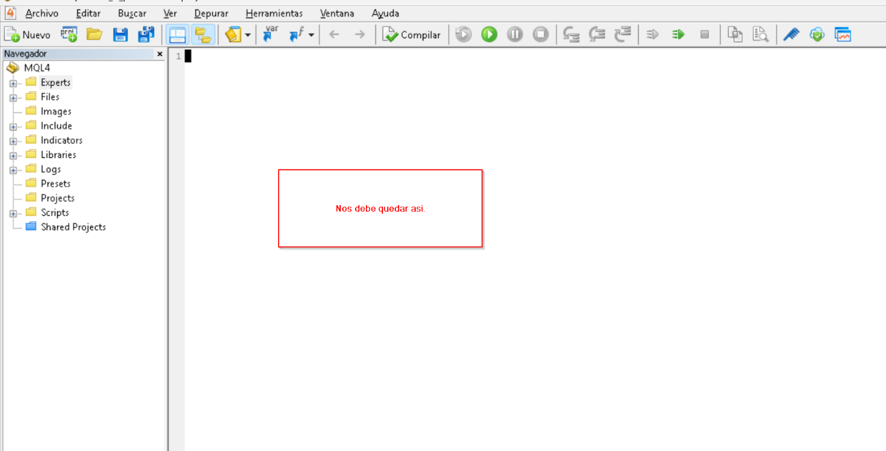
Copia este contenido en el archivo nuevo archivo,dejo el archivo, y el contenido de este.  Para que uses una de las 2 opciones, de acuerdo con tu preferencia. NOTA: LEELO, NUNCA CONFIES EN UN CODIGO QUE OTRO ESCRIBIO, USA IA COMO CHATGPT O GEMINI, PARA VALIDAR SI EL CONTENIDO ES SEGURO DE UTILIZAR. Comparto este código bajo tu propio riesgo de uso, no esta pensado para sustituir tu atención en las operaciones. Eres el único responsable al utilizarlos, sin perjuicio para terceras personas.

//+------------------------------------------------------------------+

//| Simple EA that ensures manual market orders get a maximum SL       |

//| distance automatically.                                           |

//| Place this file in MQL4/Experts and compile with MetaEditor.      |

//+------------------------------------------------------------------+

#property version   "1.00"

#property strict

//--- input parameters

input double DefaultSLDist = 30.0;   // $ distance from entry to enforce SL

input bool   ApplyToManual  = true;  // apply protection to manual orders

input int    PollSeconds    = 1;     // timer interval (seconds)

// dynamic list of tickets already processed

int _knownTickets[];

bool IsTicketKnown(int ticket)

{

   int sz = ArraySize(_knownTickets);

   for(int i = 0; i < sz; i++)

      if(_knownTickets[i] == ticket) return true;

   return false;

}

void MarkTicketKnown(int ticket)

{

   int sz = ArraySize(_knownTickets);

   ArrayResize(_knownTickets, sz + 1);

   _knownTickets[sz] = ticket;

}

void InitKnownTickets()

{

   int total = OrdersTotal();

   ArrayResize(_knownTickets, total);

   for(int i = 0; i < total; i++)

   {

      if(OrderSelect(i, SELECT_BY_POS))

         _knownTickets[i] = OrderTicket();

   }

}

// main logic: scan open market orders and add/cap SL

void ApplyManualOrderProtection()

{

   if(!ApplyToManual || DefaultSLDist <= 0) return;

   int total = OrdersTotal();

   for(int i = 0; i < total; i++)

   {

      if(!OrderSelect(i, SELECT_BY_POS)) continue;

      int ticket = OrderTicket();

      int ot     = OrderType();

      if(ot != OP_BUY && ot != OP_SELL) continue;

      if(IsTicketKnown(ticket)) continue;

      double price = OrderOpenPrice();

      double sl    = OrderStopLoss();

      double tp    = OrderTakeProfit();

      int    digs  = (int)MarketInfo(OrderSymbol(), MODE_DIGITS);

      double target_sl = NormalizeDouble(

         (ot == OP_BUY) ? price - DefaultSLDist : price + DefaultSLDist, digs);

      bool need_modify = false;

      double new_sl = sl;

      if(sl == 0)

      {

         new_sl = target_sl;

         need_modify = true;

      }

      else

      {

         double dist = (ot == OP_BUY) ? price - sl : sl - price;

         if(dist > DefaultSLDist)

         {

            new_sl = target_sl;

            need_modify = true;

         }

      }

      if(need_modify)

      {

         bool ok = OrderModify(ticket, price, new_sl, tp, 0, clrNONE);

         if(ok)

         {

            Print("ManualSL: set SL on ticket ", ticket, " -> ", DoubleToString(new_sl, digs));

            MarkTicketKnown(ticket);

         }

         else

            Print("ManualSL: modify failed ", GetLastError(), " will retry");

      }

      else

      {

         MarkTicketKnown(ticket);

      }

   }

}

int OnInit()

{

   EventSetTimer(PollSeconds);

   InitKnownTickets();

   Print("Manual SL protector initialized, DefaultSLDist=", DefaultSLDist);

   return(INIT_SUCCEEDED);

}

void OnDeinit(const int reason)

{

   EventKillTimer();

}

void OnTrade()

{

   ApplyManualOrderProtection();

}

void OnTimer()

{

   ApplyManualOrderProtection();

}

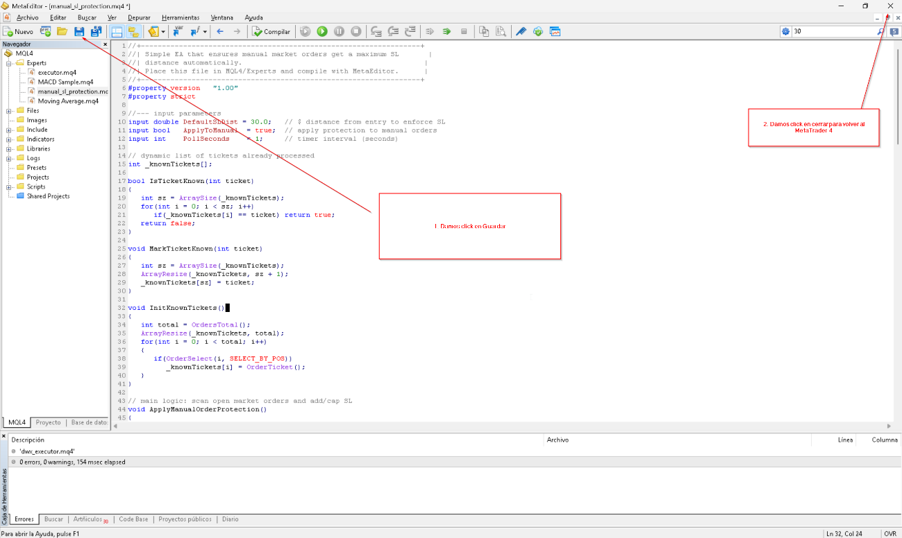

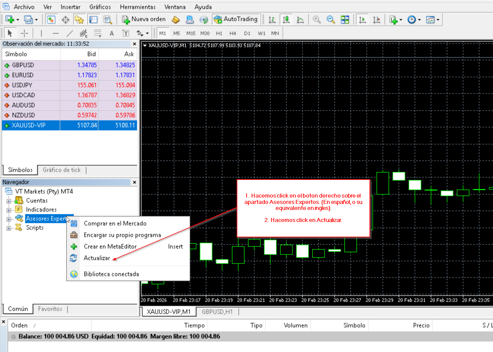

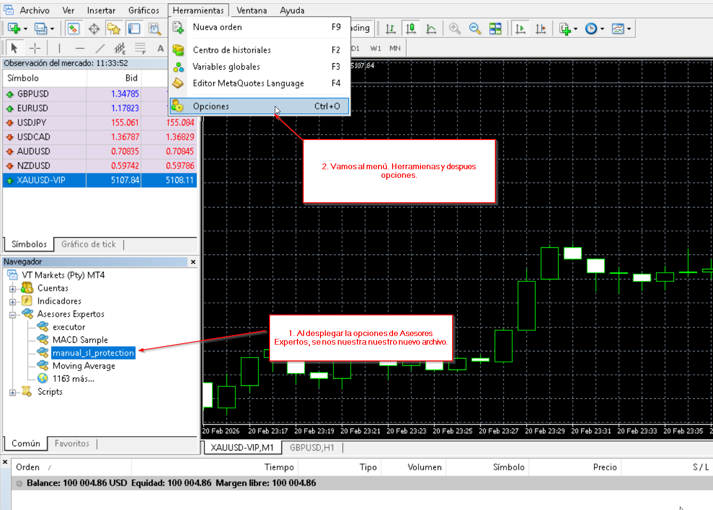

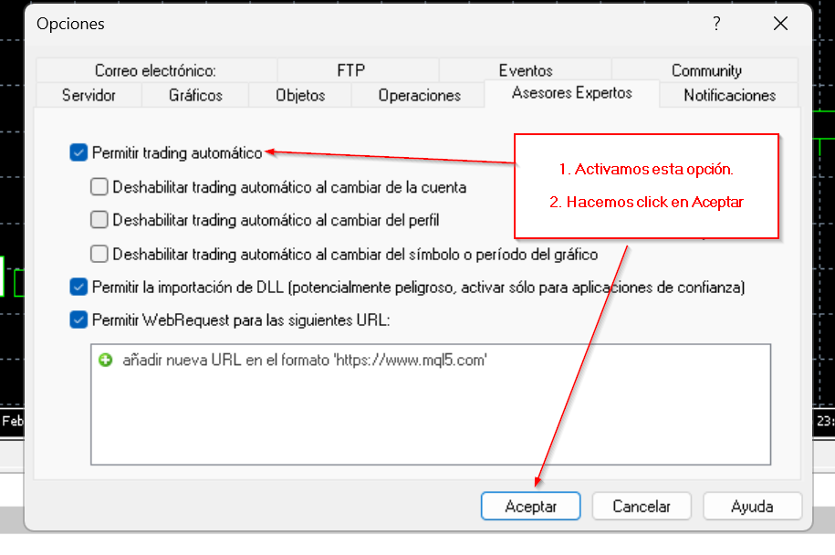

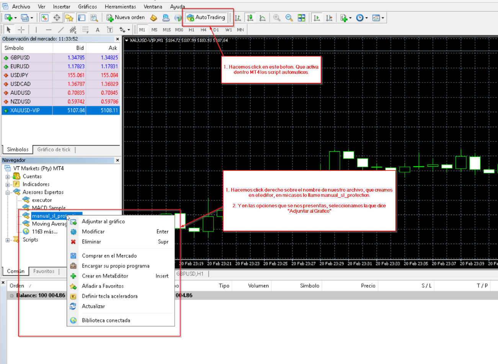

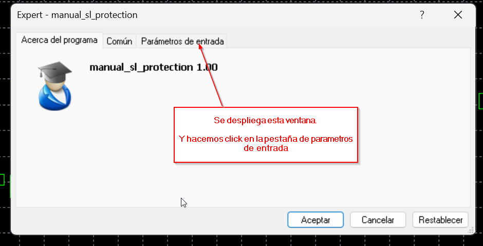

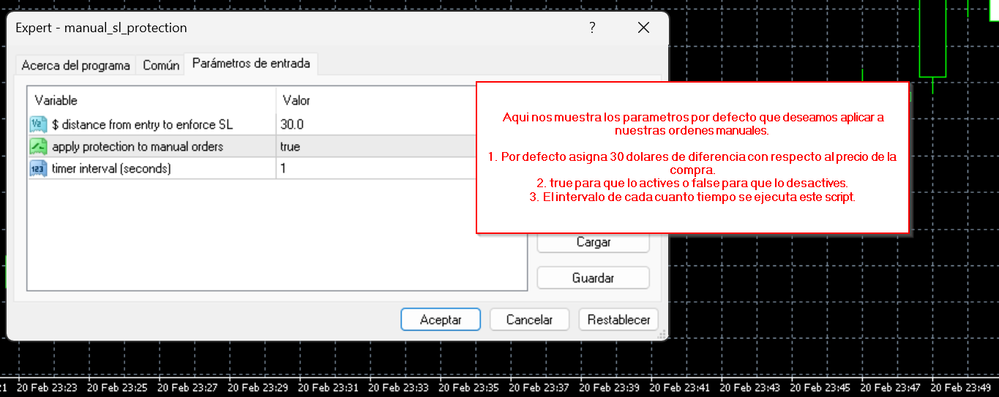

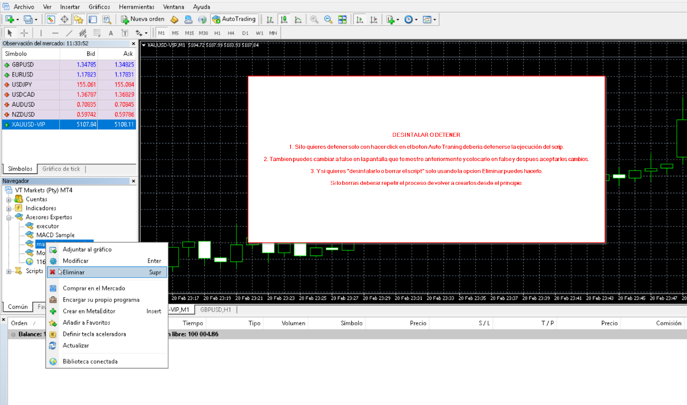

